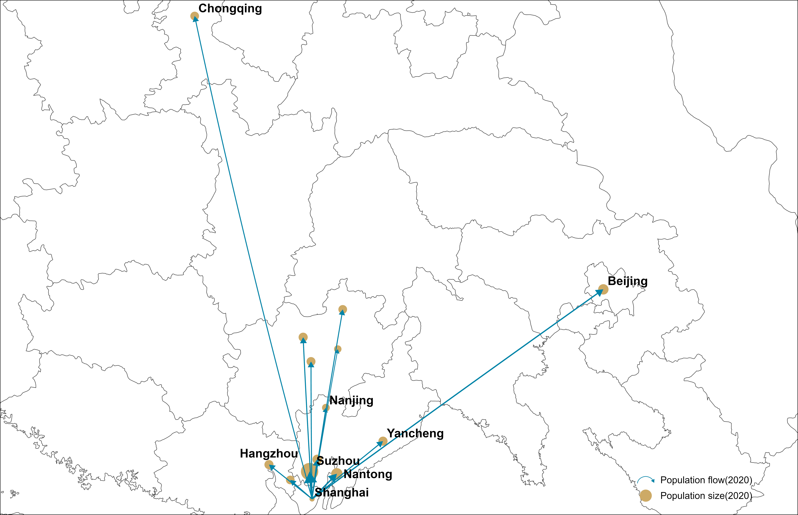

# Group 8 Final Assignment

## Data:
Pij_BAIDU.csv: Migration data for China in 2020(Following is the top 14 cities with the largest outflow of people from Shanghai)

city_cases.xlsx: The report about the virus during the January 2020 in China

country_city_province.csv : The city id in China

city_info.pkl : Preprocessed and Packaged city info include the location and id

nodes.pkl : Preprocessed and packaged city array  

pij.pkl: Preprocessed and packaged migration data

## Function:
**simulation.py**: A total call function for all the models, and it is also used to calculate the effective distance. 

**sir_model.py**: The sir simulation model.  

**data_process.py**: Originally used to process the data, now is abandoned since we have already found the processed data.  

## The whole workflow: 
(1)We first define the concept of effective distance:   
>Effective distance is a concept used to measure the implicit geometric distance between two cities and is mainly measured by the volume of the flow. For example, In China, many people travel from Shanghai to Beijing, the two cities are far away. So they may transfer to Beijing via other cities. Then, by analyzing the migration data of Shanghai, that is, the city where the most people depart from Shanghai, we can roughly calculate the city where a person departing from Shanghai is most likely to go, while ignoring the complex transportation network. This is what effective distance is meant to represent. In general, the effective path can better describe people's travel behavior by means of transportation.

(2)We define the formula in the function and based on the matrix data we calculate the effective distance of all the cities.

(3)Based on the effective distance, After the first case was found in Shanghai, we compared the time it took each city within the effective distance of Shanghai to report the discovery of the first infected person.

From the results, the closer the effective distance, the earlier the infected person was reported.  

(4)After proving that the effective distance is correct, we begin to build an improved SIR Model to simulate spread of the virus(add the migration data).

We compare the simulated results with the actual data points and find that the trend is basically consistent.

(5)The following is a simulation of virus infection under no intervention(lockdown).

(6)The following is a simulation of virus infection under intervention(lockdown).
